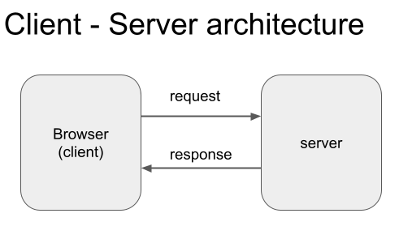

## Week 1 - Introduction to Node.js

### Reading

- Brown, Chapter 2
- https://www.tutorialspoint.com/nodejs/index.htm (Intro thru Callbacks)
- https://nodejs.dev/en/learn/

### Watch

- JS Event Loop - https://www.youtube.com/watch?v=8aGhZQkoFbQ&t=69
- https://www.linkedin.com/learning/node-js-essential-training/how-node-js-works?u=2359778

### Practice

- https://learn.freecodecamp.org/apis-and-microservices/managing-packages-with-npm

### Topics

- Class overview
- Client/server architecture
- Node.js intro & basic web server
- Handling routes & static files
- Node Package Manager (npm)
- Source control with git & github.com

### Class Overview

This class covers client-server (full-stack) web development with JavaScript (JS) technologies. It assumes prior knowledge of basic web development (JS, HTML, CSS, DOM, & HTTP)

Because the JavaScript ecosystem is huge, we won't have time to cover some important topics:
- Build tools - Grunt, Gulp, Bower, LESS/SASS, Webpack
- Various UI frameworks - Angular, Ember, Ionic, VueJS
- JS variants - TypeScript, CoffeeScript

If time permits, we will cover based web application hosting.

### Client-Server architecture terminology

- Client = browser = front-end
- Server = a remote ‘back-end’ service that responds to requests
- Full-stack = full spectrum of front-end & back-end applications
- Clients send ‘requests’ to a server and receive ‘responses’ back
- Server may run applications in a variety of programming languages (e.g. Node.js, Java, C#, PHP, Python)
- Server may connect to other specialized back-end computers (e.g. database, file storage, image server, message queue, etc.)

### What is Node.js?

Node.js is a run-time engine that executes JavaScript code outside a browser. Originally intended as a web server, but also commonly used for web development tools and automation.

- Installation https://nodejs.org/en/ (v18.x)
- Documentation - https://nodejs.org/en/docs/

A Node.js app runs in a single CPU **process** but uses built-in **asynchronous** operations to avoid **blocking** in-coming requests. Node.js perform long-running I/O operations - like reading from the network, accessing a database, or the filesystem - by handing them off to the OS and resume the operations when a response comes back.

Node.js uses an **event loop** to dispatch operations and handle responses when these complete.

Node.js can be run **interactively** to execute JavaScript commands at the command line (aka REPL). For example:
::

	$ node
	> var x = 1;
	> console.log(x)

Node.js can also execute JS files from the command line like so:
::

    $ node index.js

Where index.js is a plain text file that contains any valid JavaScript commands and can include Node.js modules.

### Node.js Web Server

This Node.js script defines a basic web server:
::

    const http = require("http"); 
    http.createServer((req,res) => {
        res.writeHead(200, {'Content-Type': 'text/plain'});
        res.end('Aloha world');
    }).listen(process.env.PORT || 3000);

- includes Node’s core **http** module for handling HTTP requests & responses
- starts a server **process** and listens for requests on a specific port.
- Uses whatever port is assigned by the operating system or ‘3000’ if none provided
- when the application receives a request, it sends a response with a ‘success’ status header and basic test

When you run this script at the command prompt, Node.js will start a server **process** and wait for requests. You can make requests to the server via a web browser at http://localhost:3000 or http://127.0.0.1:3000

### Web Server Routes

Your web server can return different responses for different types of requests, using dedicated urls (aka **route**).

For example, this script returns different responses to the client based on the request's **url** property:
::

    const http = require("http"); 
    http.createServer((req,res) => {
        var path = req.url.toLowerCase();    
        switch(path) {
            case '/':
                res.writeHead(200, {'Content-Type': 'text/plain'});
                res.end('Home page');
                break;
            case '/about':
                res.writeHead(200, {'Content-Type': 'text/plain'});
                res.end('About page');
                break;
            default:
                res.writeHead(404, {'Content-Type': 'text/plain'});
                res.end('Not found');
                break;
        }    
    }).listen(process.env.PORT || 3000);

### Static Files

Your Node.js application can read files from the filesystem and return file contents in the http response.
::

    const http = require("http");
    const fs = require("fs");
    http.createServer((req,res) => {
        let path = req.url.toLowerCase();
        switch(path) {
            case '/':
                fs.readFile("home.html", (err, data) => {
                 if (err) return console.error(err);
                    res.writeHead(200, {'Content-Type': 'text/html'});
                 res.end(data.toString());
                });
                break;
            case '/about':
                res.writeHead(200, {'Content-Type': 'text/plain'});
                res.end('About page');
                break;
            default:
                res.writeHead(404, {'Content-Type': 'text/plain'});
                res.end('Not found');
                break;
        }
    }).listen(process.env.PORT || 3000);

**Note** - be sure your file references match the actual file locations.

### Node Package Manager (NPM)

Node.js includes the **npm** utility, which streamlines application dependency management and build processes.

Node.js applications can use npm to install 3rd-party JS modules and easily extend functionality.

- Docs at https://docs.npmjs.com/
- Some widely used npm modules:
    - express - framework to handle web requests
    - nodemon - a utility that can restart a node process when underlying files change
    - cheerio - server side JQuery for parsing html files
    - lodash - functional javascript utilities

#### package.json

All npm modules have a **package.json** file that describes the module. 

Rules for package.json are at https://docs.npmjs.com/cli/v7/configuring-npm/package-json

The package.json file can be created manually, or with this command:
::

    $ npm init

Most fields in package.json are optional, but may be required if publishing your application.

**Installing npm packages**

Node modules are installed locally (in a **node_modules** sub-directory of the current folder) with this command:
::

    $ npm install <MODULE_NAME>

Modules can be installed locally and **package.json** updated at the same time:
::

    $ npm install --save <MODULE_NAME>

Modules can be installed globally for all node applications on the computer.
::

    $ npm install -g <MODULE_NAME>

Be sure to update the **.gitignore** file to exclude node-modules directories

Other useful npm commands:
****
- npm config list - show my Nodejs configuration
- npm list [global] - show what modules I have installed
- npm search <module> - search for modules by name
- npm install <options> <module>@<version>
- npm install --save-dev <module> - install module as a **dev** dependency
- npm update <module> - update a module already installed. <module> must be listed as a dependency in package.json
