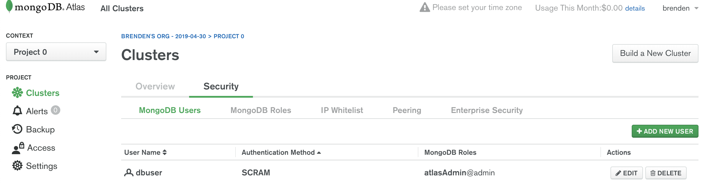
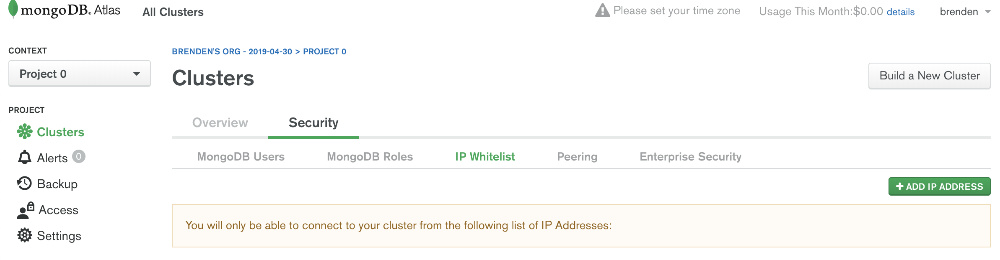

## Data Storage with MongoDB

### Reading
- Brown - Chapter 13, Database Persistence
- http://www.tutorialspoint.com/mongodb/mongodb_overview.htm
- https://developer.mozilla.org/en-US/docs/Learn/Server-side/Express_Nodejs/mongoose

### Practice
- https://learn.freecodecamp.org/apis-and-microservices/mongodb-and-mongoose

### Reference
- MongoDb - https://mongodb.github.io/node-mongodb-native/api-articles/nodekoarticle1.html
- https://github.com/mongolab/mongodb-driver-examples/blob/master/nodejs/mongooseSimpleExample.js
- https://www.w3schools.com/nodejs/nodejs_mongodb.asp
- Mongoose - http://mongoosejs.com/docs/guide.html

### Learning Outcomes
- Data persistence overview
- Schema-less -v- relational databases
- MongoDB setup and connection
- Mongoose ORM data models
- Basic Data queries - create, find, update, delete

**Schema-less** (aka no-sql) databases work on concept of collections and documents, instead of tables and columns.

**Database** is a physical container for collections.

**Collection** - a group of documents. Similar to a SQL table, but has no defined schema.

**Document** - a set of key-value pairs in JSON format. Different documents can have different pairs. Can contain any valid JS datatypes (e.g. string, number, boolean, array, object, date)

Schema-less databases have several advantages over relational (aka structured or SQL) databases:

- lower upfront DB design effort. Easier to modify as requirements change,
- data in ready-to-use JSON format 

### MongoDb

MongoDb is a popular schema-less database with well-defined frameworks for Node integration.

A hosted database on https://cloud.mongodb.com may be simplest (choose the free sandbox option). You should use a generic name for your database (e.g 'sccprojects') and create a collection specific to your class topic.

In order to connect to your hosted database from your node application, you should also:

- create a 'Database User' - be sure to use a name & password easy to remember
  

- set a 'universal' value in the IP whitelist
  

Alternatively, you can create a local database either on your PC or Cloud9, but that db will only be active while your application is running.

### Mongoose

Schema-less databases offer great flexibility, but sometimes it’s useful to set some constraints on the data your application will use.

Mongoose is a popular object-relational mapping (ORM) framework for mapping Node application objects to MongoDb documents.

As with other npm modules you need to install mongoose for your application:

    npm install mongoose --save

Then define a data-model script file. These scripts are typically stored in a /models folder and named according to the data object they describe (e.g. Person.js). The data-model script describes how to connect to the database and how the data will be structured:

    import mongoose from 'mongoose';
    const { Schema } = mongoose;

    // For security, connectionString should be in a separate file and excluded from git
    const connectionString = "mongodb+srv://<dbuser>:<dbpassword>@<cluster>.mongodb.net/test?retryWrites=true";

    mongoose.connect(connectionString, {
        dbName: 'DBNAME',
        useNewUrlParser: true,
        useUnifiedTopology: true
    });

    mongoose.connection.on('open', () => {
      console.log('Mongoose connected.');
    });

    // define data model as JSON key/value pairs
    // values indicate the data type of each key
    const bookSchema = new Schema({
     title: { type: String, required: true },
     author: String,
     count: Number,
     pubdate: Date,
     inStore: Boolean
    });

    export const Book = mongoose.model('Book', bookSchema);

- mongoose assumes the collection name is a lower-case, plural version of the model name (e.g. 'books'). If your collection name differs from this convention, you must specify it explicitly like so:

    export const Book = mongoose.model('Book', bookSchema, 'wackycollectionname');

The data model can include custom methods:

    mySchema.methods.prefix = function() {
      // add some stuff to the users name
      this.name = ‘Mr. ‘ + this.name;
      return this.name;
    };

Your application scripts can perform database operations via Mongoose using built-in MongoDB methods like .save(), .find(), etc. Because database operations can be long running, they are invoked with a callback function that handles the results on completion:

    import { Book } from "./models/book.js";

    // return all records
    Book.find({}).lean()
      .then((books) => {
        console.log(books);
      })
      .catch(err => next(err));

    // return all records that match a condition
    Book.find({"author": "Smith" }).lean()
      .then((books) => {
        console.log(book);
      })
      .catch(err => next(err));

    // return a single record
    Book.findOne({"title": "Dune" }).lean()
      .then((book) => {
          console.log(book);;
      })
      .catch(err => next(err));

    // insert or update a single record
    const newBook = {'title':'dune', 'author':'frank herbert', 'pubdate': 1963 }
    Book.updateOne({'title':'dune'}, newBook, {upsert:true}, (err, result) => {
      if (err) return next(err);
      console.log(result);
      // other code here
    });

MongoDb queries can use regular expressions to perform more nuanced pattern matching (e.g. name like 'brown' or 'Brown').  The regular expression can be hardcoded or defined with a variable as below:

    const search_pattern = new RegExp(search_term,"i");
    Book.find({"title": {$regex : search_pattern} }).lean()
      .then((books) => {
        console.log(books);
      })
      .catch(err => next(err));

The model can execute code before a built-in method with the ‘pre’ method:

    Book.pre('save', (next) => {
      // custom code
      next();
    });

### Express Routes Integration

Your Express application routes can invoke MongoDB data methods directly. For example:

    app.get('/', (req, res, next) => {
        Book.find({}).lean()
          .then((books) => {
            // respond to browser only after db query completes
            res.render('home', { books });
          .catch(err => next(err))
    });

    app.get('/detail', (req,res,next) => {
        // db query can use request parameters
        Book.findOne({ title:req.query.title }).lean()
            .then((book) => {
                res.render('details', {result: book} );
            })
            .catch(err => next(err));
    });
