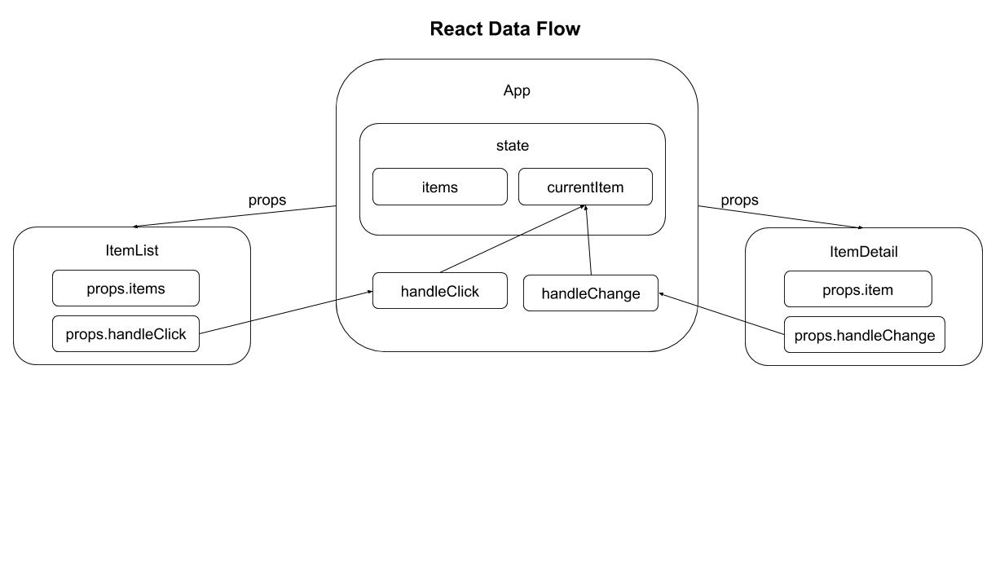

## React Events & State

### Reading
- https://react.dev/learn/adding-interactivity
- https://react.dev/learn/synchronizing-with-effects
- https://react.dev/learn/sharing-state-between-components
- https://react.dev/reference/react

### Practice
- https://www.freecodecamp.org/news/learn-react-course/

### Learning Outcomes
- What is `state`?
- What are `hooks`?
- Setting & using component state
- Lifting state from child to parent components
- HTML forms in React

### What is `state`?
Sometimes a component needs to remember information (maintain an internal `state`) that can change as users interact with the component. 

For example to track which item a user selected from a list, or how a data variable was changed.

Early versions of React prescribed `class components` to handle `state`. Now it's more common to use a `hook` within a functional component, so we'll focus on that approach.

### What are `Hooks`?
React hooks are JS functions that respond to lifecycle events and can be stateful (retain values between executions). 

React has a set of built-in hooks for common scenarios. You can also develop custom hooks for use in your application

    const MyApp = (props) => {
        const [items, setItems] = React.useState([]]);

        setItems([{"one": "First item"}, {"two": "Second item"},])

        return (
            
 
                <h2>Items List</h2>
                <Items data={items} />
            

        );
    }

What's happening here?
- we define a state variable `items` and a method `setItems` to update that variable.
- initially items has an empty array value
- items is populated with new value using `setItems`. 
- Updating `items` will cause any element that depends on it to re-render

NOTE - state variables must be updated only through the set-state methods and not directly.

### Lifting state

Component state is accessible only to the component that owns and sets it. Components don't automatically know the state of other components.

Instead, React uses a "top-down" or "unidirectional" data flow, where a component can pass its state to child components as `props`.

### HTML Forms in React

HTML form elements differ from other DOM elements in React, because they naturally keep an internal state. Input fields keep track of what a user enters.

To address this, React has a technique called `controlled components`, where the React component state is the “single source of truth”. The React component that renders a form receives updates as the user input values, adds those to component state, and propagates state back to the form.

Key aspects of the controlled component are:
- component state has a value corresponding to the form field
- component has a change-handler method to receive form-field updates
- state value & change-handler are attached to the field
