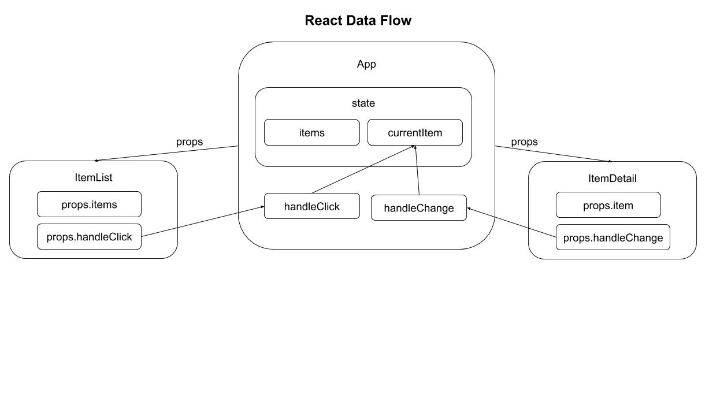

React State Management

Reading
----
- https://reactjs.org/docs/state-and-lifecycle.html
- https://reactjs.org/docs/handling-events.html
- https://reactjs.org/docs/lifting-state-up.html
- https://www.tutorialspoint.com/reactjs/reactjs_state.htm
- https://www.tutorialspoint.com/reactjs/reactjs_component_life_cycle.htm
- https://reactjs.org/docs/forms.html

Practice
----
- https://www.freecodecamp.org/news/learn-react-course/

Learning Outcomes
----
- What is 'state'?
- React class components & lifecycle methods
- Setting & using component state
- 'Lifting' state from child to parent components
- HTML forms in React

State & Class Components
----
Sometimes it's useful for a component to maintain an internal `state` that can change as users interact with the component. For example, to track of which item a user selected from a list.

React has `class` components to enable state management (also Hooks but that's a later topic).

A React class can define initial state in a 'constructor' method that initializes the class. This is the only place where state is directly assigned to a value. The constructor is automatically invoked when the component is created on the page.

Component state can be referenced in other class methods such as render().
::

    class Clock extends React.Component {
      constructor(props) {
        super(props);
        this.state = {date: new Date()};
      }
      render() {
        return ( 
 <h1>Hello, world!</h1>  <h2>It is {this.state.date.toLocaleTimeString()}.</h2>  
 );
      }
    }

    ReactDOM.render(  <Clock />,  document.getElementById('root') );

React class components can specify code that should execute when certain **lifecycle** events occur, such as when page loads or unloads:
::

    componentDidMount() {
     // code to execute when component first rendered to DOM
    }

    componentWillUnmount() {
      // code to execute when component is removed from DOM
    }

Component state can be modified outside the constructor method **only** through the setState() method:
::

    this.setState({date: new Date()});

Because React may perform state updates asynchronously, setState() commands should not rely on a component's state or props values for calculating the next state. Instead, those values can be passed as function parameters:
::

    this.setState((prevState, props) => ({
     counter: prevState.counter + props.increment
    }));

Component state is accessible only to the component that owns and sets it. Component's don't automatically know the state of other components.

Instead, React uses a "top-down" or "unidirectional" data flow, where a component can pass its state to child components as 'props'.

HTML Forms in React
----

HTML form elements work differently from other DOM elements in React, because they naturally keep an internal state. Input fields keep track of what a user enters.

To address this, React has a technique called **controlled components**, where the React component state is this “single source of truth”. The React component that renders a form receives updates as the user input values, adds those to component state, and propagates state back to the form.

Key aspects of the controlled component are:
- component state has a value corresponding to the form field
- component has a change-handler method to receive form-field updates
- state value & change-handler are attached to the field
